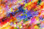
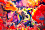

# SoundsAwful - Image to Music Encryption

## About
SoundsAwful provides a novel method for cryptographically encoding pictures as music and reversing said encryption within a simple python GUI.

## Instructions

The main program is located in ui.py.
To encode an image, select the image via the file selection dialog and click Convert. After the program finishes its conversion, you will be prompted to save the resulting midi.

The process is nearly the same for a midi. Select the file via the dialog and similarly select Convert-- you will be prompted to save the image outputted from the decryption process.

Demo video:

## Examples
Input | Midi Output | Reconstructed Image
------|-------------|--------------------
 | [Burst midi](output/Abstract_Burst.mid) | 
 | [Fluid Midi](/output/Abstract_Fluid.mid) | 

Note: Original image downscaled to 500px in width & generated image upscaled to 200px in width

## Description
The image-to-music algorithm works as such*
1. Read the image from the file
2. Downscale the image to a user-defined resolution (default 64 x 64)-- larger resolutions roughly result in longer output songs
3. Extract the red, green, and blue channels for each of these downscaled convolutions
    1. The blue channel is normalized to be between 0 and the number of notes, so that it can then be mapped to a specific note.
    2. The green channel is normalized to be between 0.25 and 2.00, representing the length of a note in terms of quarter-notes.
    3. The red channel is normalized to be between 20 and 127, representing the volume of the note in the generated file.
4. Generate chords using the inputs of the notes, lengths, and volumes
    - The actual chord generation works by generating possible chords using a baroque chord progression ruleset and a user-defined key, and then inverting the chord such that the input note is the base note.
5. Output the converted .midi file

*please note that these values are configurable for the most part

The music-to-image algorithm works by reversing the above steps; read the midi, extract the chords & their base notes, determine their quarter-note lengths & volumes, and reconstruct the downscaled image.

## Future Improvements
As shown in the video, there are a few ways we could improve this project to make it more useful for real-world applications (i.e. steganography). Some include:
- Hiding the generated chords throughout a piece of music
- More precise compression when converting from image -> midi so as to preserve more data
- A more visually pleasing GUI
- Quicker conversion (especially with larger resolutions)
- More comprehensive encryption algorithms accounting for filetype, metadata, and other properties

## Contributors
Made for the HackGT 7 hackathon by [Marius Juston](https://github.com/Marius-Juston), [Russell Newton](https://github.com/Russell-Newton), and [Akshin Vemana](https://github.com/AkshinVemana).
